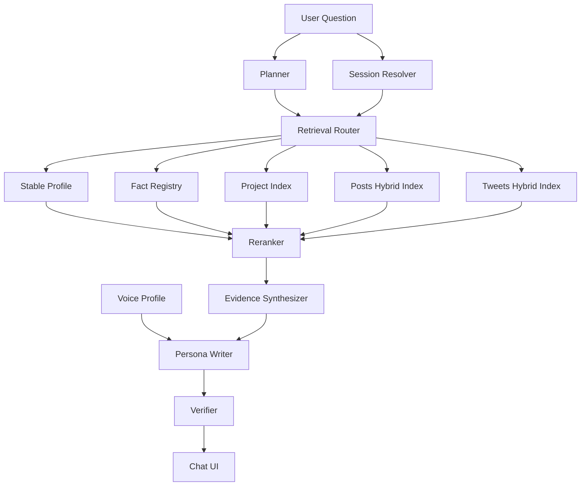

# AI 对话架构与流程升级规划

## 目标

在当前数据规模下，让博客 AI 分身同时做到 4 件事：

1. 更像你本人，而不是像一个“知道你资料的客服”。
2. 更少失真，尤其是旅行 / 马拉松 / 读书 / 项目 / 履历类问题。
3. 证据链更清楚，检索链路更简单，而不是继续堆特判。
4. 后续可以稳定迭代，不会每次改 prompt 都靠手感。

## 这次升级的核心判断

### 1. 先做 workflow，不做 swarm

结合 Anthropic 对 agent 设计的建议，你这个场景更适合固定职责的 workflow，而不是自治式多 agent swarm：

- 任务边界清楚
- 数据源固定
- 需要低延迟
- 需要强可控性
- 需要可观测和可评测

因此本次推荐的多 agent 设计，本质上是 **workflow agents**：

- 每一步输入输出固定
- 每一步都可以单测和 trace
- 每一步都能独立替换模型或规则

### 2. 先做 fact-first，再做 style-first

如果事实层不稳，越像你本人，错得越像真的。

因此升级顺序必须是：

1. 先把事实来源分层、校验、索引化
2. 再把风格和“像本人”做精

### 3. 当前数据量不需要复杂基础设施

你的核心在线数据量目前大约是：

- 341 篇博客文章
- 799 条推文
- 3 个 GitHub 项目条目

对这个量级，完全没必要一开始就上复杂分布式向量数据库或知识图谱平台。

更合适的是：

- 离线生成 JSON / SQLite / 本地索引
- 在线内存索引或轻量存储
- hybrid retrieval + rerank
- trace + eval

## 设计原则

1. 原始公开内容永远高于模型派生内容。
2. 同一条结论必须能追溯到 source ids。
3. 多 agent 是职责拆分，不是复杂化。
4. 事实、风格、会话状态分开建模。
5. 没证据时宁可保守，也不要用聚合假象补洞。
6. 所有升级都要带评测，不做“体感优化”。

## 目标架构



## 模型设计

### 1. Planner / Router

职责：

- 判断问题类型
- 判断是否需要 recentness
- 判断需要哪些数据源
- 判断能否复用上轮 session state

建议：

- 优先规则 + 轻模型混合
- 输出严格 JSON
- 不要求文采，只要求路由正确

建议输出：

```json
{
  "intent": "self_intro | profile | project | opinion | recommendation | recent_update | travel | race | reading | mixed",
  "needs_recentness": true,
  "needs_fact_registry": true,
  "needs_projects": false,
  "needs_posts": true,
  "needs_tweets": true,
  "reuse_session_state": true
}
```

### 2. Evidence Synthesizer

职责：

- 只根据检索到的 evidence pack 产出结构化 answer brief
- 给出 direct answer / claims / citations / uncertainty
- 对 count / timeline / list 类问题做聚合

建议：

- 使用结构化输出能力强、延迟稳定的模型
- 不负责文风
- 不负责讲故事
- 失败时必须回退到保守模板，而不是让 writer 自由发挥

建议输出：

```json
{
  "answer_mode": "fact | list | count | timeline | opinion | recommendation | mixed",
  "direct_answer": "一句话先给结论",
  "claims": [
    {
      "claim": "2024 年 4 月起全职独立开发",
      "source_ids": ["exp:indie-2024", "post:luolei-ai"],
      "confidence": "high"
    }
  ],
  "suggested_links": [
    {
      "title": "2026 年，我把自己做成了一个 AI",
      "url": "https://luolei.org/luolei-ai"
    }
  ],
  "uncertainties": [
    "没有检索到公开记录说明确切总数"
  ]
}
```

### 3. Persona Writer

职责：

- 把 `answer_brief` 写成像你本人会说的话
- 保留“结论 -> 依据 -> 不确定性”的结构
- 不能新增 answer brief 外的具体事实

建议：

- 主回答模型只看：
  - voice profile
  - answer brief
  - 少量原始引用片段
- 不再直接吃一大坨原始检索结果

### 4. Verifier

职责：

- 检查 final answer 中是否出现 unsupported claim
- 检查 URL 是否来自 allowed set
- 检查数字 / 时间 / 公司 / 项目名是否能回溯到 source ids

建议：

- 先做规则校验
- 再做轻模型二次校验
- 如果 verifier 不通过，优先降级为更保守答案

## 数据层设计

### 1. `source_docs`

这是事实层的地基。所有公开内容先统一成 canonical source docs。

建议新增离线产物：

- `data/source-docs/posts.jsonl`
- `data/source-docs/tweets.jsonl`
- `data/source-docs/projects.jsonl`

每条记录最少包含：

```json
{
  "source_id": "post:luolei-ai",
  "source_type": "post",
  "title": "2026 年，我把自己做成了一个 AI",
  "url": "https://luolei.org/luolei-ai",
  "date": "2026-03-03",
  "text": "...",
  "summary": "...",
  "tags": ["ai", "rag"],
  "metadata": {
    "author_asserted": true
  }
}
```

### 2. `chunk_index`

对 posts / tweets / projects 做两套检索视图：

- sparse index：BM25 / lexical
- dense index：embedding

同时保留 contextual metadata：

- source type
- date
- categories
- intent tags
- project name / location / event type 等

对博客文章建议：

- 摘要 chunk
- key points chunk
- 正文 chunk
- 给每个 chunk 增加 contextual header

这对应 Anthropic 的 contextual retrieval 思路：不是只切块，还要让 chunk 带上足够的局部上下文。

### 3. `fact_registry`

这是这次升级里最关键的新层。

不要再把 travel / race / reading 这种聚合事实直接塞进 prompt，而是改成可验证的事实注册表。

建议新增：

- `data/fact-registry.json`

结构建议：

```json
{
  "fact_id": "travel:japan",
  "fact_type": "travel_destination",
  "value": "日本",
  "confidence": "validated",
  "provenance": "derived_from_sources",
  "source_ids": ["post:tokyo-2024", "post:kyoto-marathon-2025"],
  "attributes": {
    "trip_count_min": 3,
    "count_mode": "at_least"
  }
}
```

建议把知识分成 4 层：

1. `authored_public`
   - 原始博客、原始推文、原始 GitHub 履历
2. `curated_public`
   - GitHub README/RESUME 里的自述型条目
3. `validated_derived`
   - 经过 verifier 的 travel/race/reading/project facts
4. `style_only`
   - 风格画像、表达习惯、长期语气

只有前 3 层能参与 factual answers，第 4 层只能参与写作风格。

### 4. `voice_profile`

为了增强“像你本人”，建议单独产出：

- `data/voice-profile.json`

来源不是第三方画像，而是你自己的第一人称内容：

- 博客正文
- 推文原文
- 标题和常用表达

建议提取：

- 句式偏好
- 常见口头转折词
- 技术话题的表达风格
- 生活话题的表达风格
- 幽默/自嘲/emoji 使用习惯
- 是否喜欢先讲结论再补背景

### 5. `session_state`

当前缓存的是：

- 上轮 query
- 上轮 articles / tweets
- 上轮 evidence brief

升级后建议缓存真正的会话状态：

```json
{
  "session_id": "...",
  "last_intent": "travel",
  "resolved_entities": ["日本", "京都马拉松"],
  "last_source_ids": ["fact:travel:japan", "post:kyoto-marathon-2025"],
  "last_answer_brief": { "...": "..." },
  "open_questions": ["日本去了几次还未确认精确值"]
}
```

这会比“只复用上轮检索结果”稳定得多。

## 多 agent / workflow 设计

### Agent A: Planner

输入：

- 最新用户问题
- 最近 1-2 轮会话状态

输出：

- intent
- data sources
- recentness need
- reuse decision

失败兜底：

- 回退到规则路由，不阻塞回答

### Agent B: Retrieval Router

输入：

- planner 输出

输出：

- 多个候选 evidence buckets

路由规则建议：

- 自我介绍 / 长期画像：`stable_profile + flagship_posts + voice_profile`
- 项目 / 技术栈：`project_index + related_posts + related_tweets`
- 最近在做什么：`recent_tweets + latest_posts + latest_project_updates`
- 旅行 / 跑步 / 读书：`fact_registry first, source docs second`
- 观点问题：`posts first, tweets second`

### Agent C: Reranker

职责：

- 把多源结果压成最终 evidence pack
- 控制 source diversity
- 控制 recentness 和 authority 的平衡

建议：

- 至少确保最终 evidence pack 里 source type 不单一
- 对 factual questions，优先 fact registry + 原始文档
- 对 opinion questions，优先长文博客

### Agent D: Evidence Synthesizer

职责：

- 输出 `answer_brief`
- 做 entity normalization
- 做 count / timeline aggregation
- 显式写 uncertainty

关键要求：

- 每个 claim 必须带 source ids
- 没证据就不生成 claim
- 对 exact / at_least / unknown 区分严格

### Agent E: Persona Writer

职责：

- 只负责“怎么说”
- 不负责“说什么”

约束：

- 只允许使用 `answer_brief.claims`
- 允许引用 `voice_profile`
- 禁止生成未在 claims 中出现的数字、事件、地点

### Agent F: Verifier

职责：

- rule-based:
  - URL allowlist
  - 数字检查
  - 公司 / 项目 /日期检查
- model-based:
  - unsupported claim detection
  - style drift detection

失败策略：

- 如果 verifier 失败，直接回退到更短、更保守的回答

## 针对当前系统的立即动作

### Phase 0：先止血

预计投入：1-2 天

目标：

- 先停止“错事实继续污染主回答”

动作：

1. 在聊天链路里把 `structuredFacts` 从“优先参考”降为“辅助索引”，或暂时禁用 travel / race / reading 聚合事实注入。
2. 给 `structuredFacts` 增加 provenance / confidence 字段；未校验项不进入 prompt。
3. 新增 project search index，把 GitHub / 履历变成 query-time retrieval source。
4. 为每轮聊天 trace 记录：
   - planner result
   - retrieved source ids
   - evidence brief
   - final cited source ids
5. 建立最小评测集，先覆盖 30-50 个高频问题。

验收标准：

- “去过哪些国家 / 读过多少书 / 跑过哪些马拉松”不再出现明显错例
- “你做过什么项目”类问题开始引用项目源
- trace 能回放每轮 evidence chain

### Phase 1：建立 canonical source docs + fact registry

预计投入：2-4 天

目标：

- 把事实层从 prompt 文本升级成可检索、可验证的数据层

动作：

1. 新增 source docs 生成脚本。
2. 新增 fact registry 生成脚本。
3. 对 travel / race / reading 做“候选抽取 -> canonicalize -> verifier”三段式处理。
4. 为每条 fact 记录 source ids 和 confidence。

建议新增文件：

- `scripts/build-source-docs.mjs`
- `scripts/build-fact-registry.mjs`
- `src/lib/chat/facts/types.ts`
- `src/lib/chat/facts/registry.ts`

验收标准：

- 事实查询优先命中 fact registry
- 每条 fact 都能回溯到 source docs
- 当前 `structured-facts-aggregated.json` 中的明显脏数据不再出现在在线回答里

### Phase 2：Hybrid Retrieval + Rerank

预计投入：3-5 天

目标：

- 降低 query 特判复杂度
- 提高语义召回与跨源召回质量

动作：

1. 为 posts / tweets / projects 建 dense embeddings。
2. 保留现有 lexical search 作为 sparse 分支。
3. 引入 hybrid score 和 reranker。
4. 在 chunk 中增加 contextual header。

建议新增文件：

- `scripts/build-embeddings.mjs`
- `data/embeddings/*.jsonl`
- `src/lib/chat/retrieval/hybrid-search.ts`
- `src/lib/chat/retrieval/rerank.ts`

验收标准：

- 模糊问法、同义问法召回明显改善
- route.ts 里的 query 特判和 travel 特判开始减少

### Phase 3：Answer Brief + Verifier

预计投入：2-4 天

目标：

- 从“evidence analysis 文本回写”升级到“answer brief 强约束”

动作：

1. `evidence-analysis` 输出保留 JSON，不再转换成普通 markdown 作为唯一中间态。
2. writer 只接受 answer brief。
3. 新增 verifier 步骤。
4. unsupported claim 失败时自动降级。

建议新增文件：

- `src/lib/chat/workflow/planner.ts`
- `src/lib/chat/workflow/evidence-synthesizer.ts`
- `src/lib/chat/workflow/persona-writer.ts`
- `src/lib/chat/workflow/verifier.ts`

验收标准：

- factual answers 的 citation precision 明显提升
- unsupported claim rate 明显下降

### Phase 4：Voice Profile 与 Persona Refinement

预计投入：2-3 天

目标：

- 提升“像你本人”的稳定性

动作：

1. 从第一人称博客 / 推文生成 `voice-profile.json`
2. 把 voice profile 接入 writer
3. 视问题类型切换 style mode：
   - `casual`
   - `technical`
   - `reflective`
   - `recommendation`

建议新增文件：

- `scripts/build-voice-profile.mjs`
- `src/lib/chat/persona/voice-profile.ts`

验收标准：

- 回答语气更统一
- 技术类和生活类回答不再像同一个模板写出来的

### Phase 5：扩展模态与长期数据

预计投入：按需

目标：

- 继续提升人格完整度，而不是只提升问答准确率

可选数据源：

- YouTube / Bilibili 字幕转写
- Unsplash / 摄影作品说明
- 更多 GitHub 项目与 README
- 公开演讲 / 采访 / 访谈文本

原则：

- 先做 source docs
- 后做 retrieval
- 最后才进入 factual answers

## 评测与可观测性

### 1. 最小评测集

建议至少 60 题，按 8 类覆盖：

1. 自我介绍
2. 履历 / 时间线
3. 项目 / 技术栈
4. 最近动态
5. 旅行 / 跑步 / 读书
6. 观点 / 为什么
7. 推荐 / 导航
8. 无答案 / 不确定性测试

每题记录：

- 用户问题
- 预期 answer mode
- 必须命中的 source ids
- 禁止编造的点
- 是否允许 `at_least`

### 2. 指标

建议至少跟踪：

- `retrieval_hit_rate`
- `citation_precision`
- `claim_support_rate`
- `unsupported_claim_rate`
- `abstention_quality`
- `persona_similarity`
- `latency_p95`

### 3. Trace 日志

每轮保留：

- session id
- planner output
- retrieval candidates
- selected evidence ids
- answer brief
- verifier result
- final answer
- latency / token usage

这对应 OpenAI 在 eval/graders 文档里强调的 trace-based grading 思路：不是只看最终答案，还要能审查中间步骤。

## 推荐的文件落地清单

建议按下面的顺序补齐：

- `scripts/build-source-docs.mjs`
- `scripts/build-fact-registry.mjs`
- `scripts/build-voice-profile.mjs`
- `data/source-docs/posts.jsonl`
- `data/source-docs/tweets.jsonl`
- `data/source-docs/projects.jsonl`
- `data/fact-registry.json`
- `data/voice-profile.json`
- `data/chat-evals.json`
- `src/lib/chat/retrieval/hybrid-search.ts`
- `src/lib/chat/retrieval/router.ts`
- `src/lib/chat/workflow/planner.ts`
- `src/lib/chat/workflow/evidence-synthesizer.ts`
- `src/lib/chat/workflow/persona-writer.ts`
- `src/lib/chat/workflow/verifier.ts`

## 最后给你的明确建议

如果只选 3 件事先做，我建议是：

1. **先停掉未校验 `structuredFacts` 的高优先级注入。**
2. **把 GitHub / 项目事实拉进 query-time retrieval。**
3. **把 evidence analysis 升级成 answer brief + verifier。**

这 3 步做完，你会马上感受到：

- 数据失真明显下降
- 证据检索逻辑明显更清楚
- “像你本人”这件事终于有了稳定地基

## 参考的业界实践

- Anthropic, *Building effective agents*  
  https://www.anthropic.com/engineering/building-effective-agents
- Anthropic, *Introducing contextual retrieval*  
  https://www.anthropic.com/engineering/contextual-retrieval
- OpenAI Cookbook, *Eval driven system design*  
  https://cookbook.openai.com/examples/evaluation/eval_driven_system_design
- OpenAI Cookbook, *Graders for reinforcement fine-tuning / trace grading ideas*  
  https://cookbook.openai.com/examples/reinforcement_fine_tuning/graders

## 状态

- [x] 升级目标明确
- [x] 目标架构明确
- [x] 多 agent / workflow 方案明确
- [x] 分阶段执行顺序明确
- [ ] 进入 Phase 0 实施
